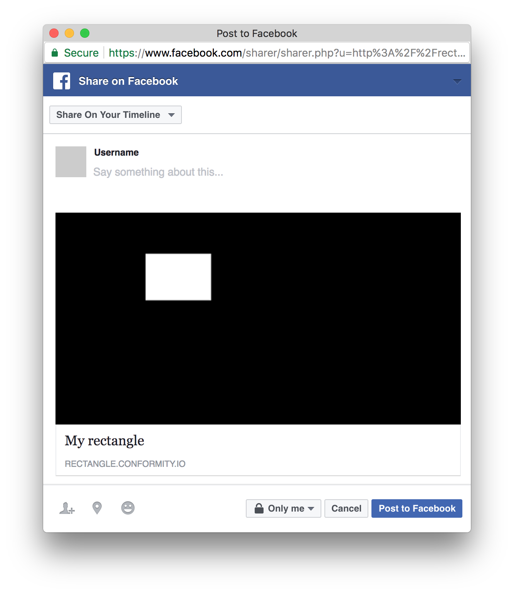

# Draw a rectangle

The simplest thing you can share on facebook.

Small node.js app which let users draw one rectangle and share it on facebook.





### Development

To run the app locally:

1. Create `settings.json` file in the project root (optional)
    ```json
    {
      "port": 6200,
      "indexPageTitle": "Draw a rectangle",
      "sharePageTitle": "My rectangle",
      "pageDescription": "",
      "publicUrl": "http://yourpublicurl.com",
      "gaClientId": "your_google_ua_id_here"
    }
    ```

2. Install [graphicsmagick](http://www.graphicsmagick.org/README.html#installation)
    ```
    brew install graphicsmagick // mac os
    apt-get install graphicsmagick // ubuntu
    ```

2. Install dependencies and run the app
    ```
    npm i && npm start
    ```


### Credits

Mikhail Maximov and Valia Fetisov


### License [MIT](https://opensource.org/licenses/MIT)
